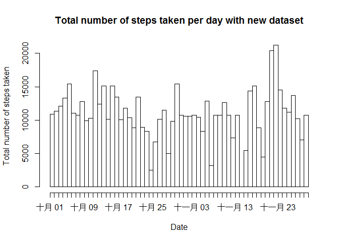

# Reproducible Research: Peer Assessment 1


## Loading and preprocessing the data

```r
activity <- read.csv("~/activity.csv")
```

## What is mean total number of steps taken per day?

1. Calculate the total number of steps taken per day

```r
totstep.per.day <- tapply(activity$steps,activity$date,sum,na.rm = T)
```

2. Make a histogram of the total number of steps taken each day

```r
hist.data1 <- c()
for(i in 1:length(totstep.per.day)){
    if(totstep.per.day[i]!=0)
        hist.data1 <- c(hist.data1,rep(names(totstep.per.day)[i],totstep.per.day[i]))
}
hist.data1 <- as.Date(hist.data1)
dates <- as.Date(unique(activity$date))
hist(hist.data1,ylab = "Total number of steps taken",xlab = "Date",breaks = dates,freq = T,main = "Total number of steps taken per day")
```

 

3. Calculate and report the mean and median of the total number of steps taken per day

```r
meanstep.per.day <- mean(totstep.per.day,na.rm = T )
medianstep.per.day <- median(totstep.per.day,na.rm = T)
```
So,the mean is 9354.2295082, median is 10395.

## What is the average daily activity pattern?

1. Make a time series plot (i.e. type = "l") of the 5-minute interval (x-axis) and the average number of steps taken, averaged across all days (y-axis)

```r
avg.step.inv <- tapply(activity$steps,activity$interval,mean,na.rm =T)
plot(x = names(avg.step.inv),y = avg.step.inv,type = "l",xlab = "the 5-minute interval",ylab = "the average number of steps taken", main = "The average number of steps taken across all days")
```

 

2. Which 5-minute interval, on average across all the days in the dataset, contains the maximum number of steps?

```r
max.inv <- names(avg.step.inv)[which.max(avg.step.inv)]
```
The 5-minute interval, on average across all the days in the dataset, is 835.

## Imputing missing values
1. Calculate and report the total number of missing values in the dataset (i.e. the total number of rows with NAs)

```r
summary(activity)
```

```
##      steps                date          interval     
##  Min.   :  0.00   2012-10-01:  288   Min.   :   0.0  
##  1st Qu.:  0.00   2012-10-02:  288   1st Qu.: 588.8  
##  Median :  0.00   2012-10-03:  288   Median :1177.5  
##  Mean   : 37.38   2012-10-04:  288   Mean   :1177.5  
##  3rd Qu.: 12.00   2012-10-05:  288   3rd Qu.:1766.2  
##  Max.   :806.00   2012-10-06:  288   Max.   :2355.0  
##  NA's   :2304     (Other)   :15840
```
It's obviously that "steps" is only field which contains NAs, and the total number of rows with NAs is 2304.

2. Use the mean for that 5-minute interval for filling in all of the missing values in the dataset.Create a new dataset that is equal to the original dataset but with the missing data filled in.

```r
na.ind <- which(is.na(activity$steps))
na.inv <- activity$interval[na.ind]
temp <- match(na.inv,names(avg.step.inv))
activity.new <- activity
activity.new$steps[na.ind] <- avg.step.inv[temp]
summary(activity.new)
```

```
##      steps                date          interval     
##  Min.   :  0.00   2012-10-01:  288   Min.   :   0.0  
##  1st Qu.:  0.00   2012-10-02:  288   1st Qu.: 588.8  
##  Median :  0.00   2012-10-03:  288   Median :1177.5  
##  Mean   : 37.38   2012-10-04:  288   Mean   :1177.5  
##  3rd Qu.: 27.00   2012-10-05:  288   3rd Qu.:1766.2  
##  Max.   :806.00   2012-10-06:  288   Max.   :2355.0  
##                   (Other)   :15840
```

3. Make a histogram of the total number of steps taken each day and Calculate and report the mean and median total number of steps taken per day. Do these values differ from the estimates from the first part of the assignment? What is the impact of imputing missing data on the estimates of the total daily number of steps?

```r
totstep.per.day.n <- tapply(activity.new$steps,activity.new$date,sum,na.rm = T)
hist.data2 <- c()
for(i in 1:length(totstep.per.day.n)){
    if(totstep.per.day.n[i]!=0)
        hist.data2 <- c(hist.data2,rep(names(totstep.per.day.n)[i],totstep.per.day.n[i]))
}
hist.data2 <- as.Date(hist.data2)
hist(hist.data2,ylab = "Total number of steps taken",xlab = "Date",breaks = dates,freq = T,main = "Total number of steps taken per day with new dataset")
```

 

```r
meanstep.per.day.n <- mean(totstep.per.day.n,na.rm = T )
medianstep.per.day.n <- median(totstep.per.day.n,na.rm = T)
```
The mean is 1.0766189\times 10^{4}, median is 1.0766189\times 10^{4}.
Both the two values are increase, and furthermore, the two valuse are equal.

## Are there differences in activity patterns between weekdays and weekends?
For this part Use the dataset with the filled-in missing values for this part.

1. Create a new factor variable in the dataset with two levels – “weekday” and “weekend” indicating whether a given date is a weekday or weekend day.

```r
week <- weekdays(as.Date(activity.new$date))
week[which(week %in% c("星期一","星期二","星期三","星期四","星期五"))] <- "weekday"
week[which(week %in% c("星期六","星期日"))] <- "weekend"
activity.new$isweekday <- factor(week,level = c("weekday","weekend"))
```

2. Make a panel plot containing a time series plot (i.e. type = "l") of the 5-minute interval (x-axis) and the average number of steps taken, averaged across all weekday days or weekend days (y-axis). See the README file in the GitHub repository to see an example of what this plot should look like using simulated data.

```r
temp1 <- which(activity.new$isweekday == "weekday")
temp2 <- which( activity.new$isweekday == "weekend")
avg.step.inv.wd <- tapply(activity.new$steps[temp1],activity$interval[temp1],mean,na.rm =T)
avg.step.inv.we <- tapply(activity.new$steps[temp2],activity$interval[temp2],mean,na.rm =T)
avg.weekday <- data.frame(inv = names(avg.step.inv.wd),
                          avg = avg.step.inv.wd,
                          is.weekday = "weekday")
avg.weekend <- data.frame(inv = names(avg.step.inv.we),
                          avg = avg.step.inv.we,
                          is.weekday = "weekend")
avg.week <- rbind(avg.weekday,avg.weekend)
avg.week <- avg.week[order(avg.week$is.weekday,avg.week$inv),]
library(lattice)
xyplot(avg ~ inv | is.weekday,data = avg.week,type = "l",,layout=c(1,2),xlab = "the 5-minute interval",ylab = "the average number of steps taken")
```

 
